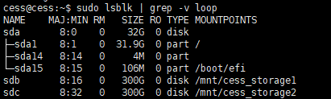
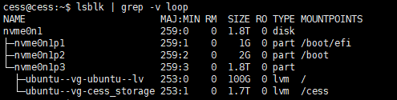

# Architecture

多存储节点架构如下所示:
- watchTower: 当本地的 bucket 镜像与官方的 bucket 镜像有差异时，watchtower会自动拉取官方的新镜像，在创建一个新的 bucket 容器后删除旧的 bucket 容器
- bucket: 存储节点，多个存储节点之间会进行 P2P 通信，在示例配置文件中配置的通信端口为：15001、15002
- chain: 链节点，存储节点默认通过链节点的 9944 端口获取区块信息；链节点之间默认通过 30336 端口进行数据同步


# 服务器要求

最低配置需求：

| 资源 | 规格 |
| --- | --- |
| 推荐操作系统 | Linux 64 位英特尔/AMD |
| CPU 核心数 | ≥4 |
| 内存 | ≥8GB |
| 带宽 | ≥5Mbps |
| 公网 IP | 必需 |
| Linux 内核版本 | 5.11 或更高版本 |

每个存储节点至少需要 4GB 内存和 1 个逻辑核，链节点至少需要 2GB 内存和 1 个逻辑核

如同时运行 2 个存储节点以及 1 个链节点，则至少需要 10GB 内存和 3 个逻辑核

# 一键安装多个存储节点

## 存储环境需求

执行安装操作对当前运行环境中的存储环境有一定的需求，需要根据**磁盘数量的不同**进行不同的配置

### 多盘环境

如下图所示，其中 `/dev/sda` 为系统盘，`/dev/sdb`，`/dev/sdc` 为数据盘，用户可以直接在数据盘上进行分区并创建文件系统，最后将文件系统挂载至存储节点的工作目录即可。



```bash
fdisk /dev/sdb

# 2048: 新磁盘的起始扇区通常设为2048，这样可以确保分区边界与硬盘的物理扇区对齐，提高硬盘的读写效率
# the value after default: 默认为最大扇区值，即对整个磁盘进行分区。

Enter and press Enter:
n
p
1
2048
the value after default
w

# 在 /dev/vdb 上创建文件系统
sudo mkfs.ext4 /dev/sdb

Proceed anyway? (y,N) y

# 创建存储节点的工作目录
sudo mkdir /cess_storage1

# 挂载文件系统至该目录
sudo mount /dev/sdb /cess_storage1

# 配置文件系统开机自动挂载
sudo cp /etc/fstab /etc/fstab.bak

# 修改 </dev/sdb> </cess_storage1>
sudo sh -c "echo `blkid /dev/sdb | awk '{print $2}' | sed 's/\"//g'` /cess_storage1 ext4 defaults 0 0 >> /etc/fstab"
```
重复以上步骤为 `/dev/sdc` 进行分区并创建文件系统，然后将其挂载至文件目录：`/cess_storage2`


在一块磁盘划分为多个分区的情况下，当磁盘损坏时，将影响所有使用其分区进行工作的存储节点


### 单盘环境
该操作步骤适用于只有一块系统盘的环境

#### 场景1：

如下所示，在只有 1 块 50GB 系统盘的情况下， 磁盘 `/dev/sda` 的分区 `/dev/sda3` 的 `Last sector 扇区值` 已经是最大值（50GB的磁盘已经不能再分出多余的存储空间）。
```bash
[root@cess ~]# lsblk 
NAME   MAJ:MIN RM  SIZE RO TYPE MOUNTPOINT
sda    253:0    0   50G  0 disk 
├─sda1 253:1    0    2M  0 part 
├─sda2 253:2    0  200M  0 part /boot/efi
└─sda3 253:3    0 49.8G  0 part /
```
如上所示，`/dev/sda3` 已经将 50GB 存储空间占满，且当前系统正在使用这个分区，所以无法通过修改分区来搭建多存储节点所需的运行环境。

如果分区未占满整块磁盘，仍有剩余存储空间可供分区，则可参考 **多盘环境** 的配置方法进行分区配置，在这种环境下，多个存储节点的运行都将依赖于这块磁盘

#### 场景2：

如下图所示，当前环境仅有一块存储空间约为 1.8T的 `/dev/nvme0n1` 系统盘，这块系统盘进行了 3 次分区 ，包括 `/dev/nvme0n1p1`、`/dev/nvme0n1p2` 和 `/dev/nvme0n1p3`
当前系统的运行依赖于在第 3 个分区 `/dev/nvme0n1p3` 中创建的虚拟逻辑盘 `/dev/ubuntu-vg/ubuntu-lv`，由于该虚拟逻辑盘仅占用了 100GB 存储空间，所以可通过 lvm 在剩余空间上创建多个虚拟逻辑卷的方式来配置多存储节点的运行环境



```bash
# 使用 vgs 命令查看当前卷组，可以发现当前卷组名称为： ubuntu-vg，VFree显示了当前卷组的剩余存储空间
$ vgs
cess@cess:/home/cess# vgs
  VG        #PV #LV #SN Attr   VSize   VFree
  ubuntu-vg   1   1   0 wz--n- <1.82t  1.7T

# 使用 lvcreate 命令从卷组：ubuntu-vg 中创建一个 100GB 大小且名为 cess_storage 的虚拟逻辑卷
$ sudo lvcreate -L 100g -n cess_storage ubuntu-vg -y
# 使用 lvcreate 命令从卷组：ubuntu-vg 的所有剩余空间中创建一个名为 cess_storage 的虚拟逻辑卷
# sudo lvcreate -l 100%FREE -n cess_storage ubuntu-vg -y

# lvdisplay 查看创建成功的虚拟逻辑卷，名称: cess_storage、路径: /dev/ubuntu-vg/cess_storage
$ sudo lvdisplay
root@cess:/home/cess# lvdisplay
  --- Logical volume ---
  LV Path                /dev/ubuntu-vg/ubuntu-lv
  LV Name                ubuntu-lv
  VG Name                ubuntu-vg
  LV UUID                zxJiPj-Anon-CG3r-XEIJ-Nydi-xxxx-U6oWqW
  LV Size                100.00 GiB
   
  --- Logical volume ---
  LV Path                /dev/ubuntu-vg/cess_storage
  LV Name                cess_storage
  VG Name                ubuntu-vg
  LV UUID                33Z2eL-AVma-oV4V-1vnE-G3YC-xxxx-wtzxHs
  LV Size                <1.72 TiB

# 创建文件系统
$ sudo mkfs.ext4 /dev/ubuntu-vg/cess_storage

# 创建目录
sudo mkdir /cess

# 挂载文件系统至该目录
sudo mount /dev/ubuntu-vg/cess_storage /cess

# 配置开机自动挂载
sudo cp /etc/fstab /etc/fstab.bak
# 修改 lv路径、文件目录、文件系统类型
sudo sh -c "echo `blkid /dev/ubuntu-vg/cess_storage | awk '{print $2}' | sed 's/\"//g'` /cess ext4 defaults 0 0 >> /etc/fstab"
```


用户可以通过 lvm 的方式在一块硬盘上创建多个虚拟逻辑卷，将多个虚拟逻辑卷挂载在不同的 diskPath 上，但当该硬盘损坏时，所有依赖 lvm 的存储节点都将发生异常 !


## 1. 下载并安装 multibucket 管理客户端

```bash
sudo wget https://github.com/CESSProject/cess-multibucket-admin/archive/latest.tar.gz
sudo tar -xvf latest.tar.gz
cd cess-multibucket-admin-latest
sudo bash ./install.sh
```

## 2. 自定义配置文件

安装完成后, 用户需要根据实际需求修改文件: `/opt/cess/multibucket-admin/config.yaml`


- UseSpace: 存储节点的存储能力，单位为 GB
- UseCpu: 存储节点使用的逻辑核心数
- port: 存储节点 P2P 通信端口，每个存储节点的端口必须不同且没有被其他服务占用
- diskPath: 存储节点工作的系统绝对路径，需要在该路径下挂载文件系统
- earningsAcc: 收入账户， [如何获取账户和助记词](https://docs.cess.cloud/core/v/zh/storage-miner/running#zhun-bei-cess-zhang-hu)
- stakingAcc: 质押 TCESS 的付款账户，每提供 1T 的存储空间需要质押 4000 个 TCESS
- mnemonic: 账户助记词，由 12 个单词组成，每个存储节点需要提供不同的助记词
- chainWsUrl: 默认通过本地的 RPC 节点进行存储节点之间的数据同步，`buckets[].chainWsUrl` 的优先级高于 `node.chainWsUrl`
- backupChainWsUrls: 备用 RPC 节点，可以使用官方提供的 RPC 节点或者你所知的其他 RPC 节点，`buckets[].backupChainWsUrls` 的优先级高于 `node.backupChainWsUrls`

   ```yaml
   ## node configurations template
   node:
      ## the mode of node: multibucket
      mode: "multibucket"
      ## the profile of node: devnet/testnet/mainnet
      profile: "testnet"
      # default chain url for bucket, this config will be overwritten in buckets[] as below
      chainWsUrl: "ws://127.0.0.1:9944/"
      # default backup chain urls for bucket, this config will be overwritten in buckets[] as below
      backupChainWsUrls: ["wss://testnet-rpc0.cess.cloud/ws/", "wss://testnet-rpc1.cess.cloud/ws/", "wss://testnet-rpc2.cess.cloud/ws/", "wss://testnet-rpc3.cess.cloud/ws/"]

   ## chain configurations
   ## set option: '--skip-chain' or '-s' to skip installing chain
   ## if set option: --skip-chain, please set official chain in bucket[].chainWsUrl
   chain:
      ## the name of chain node
      name: "cess"
      ## the port of chain node
      port: 30336
      ## listen rpc service at port 9944
      rpcPort: 9944

   ## bucket configurations  (multi storage miner mode)
   buckets:
      - name: "bucket_1"
        # P2P communication port
        port: 15001
        # Maximum space used, the unit is GiB
        UseSpace: 1000
        # Number of cpu's used, 0 means use all
        UseCpu: 2
        # earnings account
        earningsAcc: "cXxxxxxxxxxxxxxxxxxxxxxxxxxxxxxxxxxxxxxxxxxxxxxxx"
        # Staking account
        # If you fill in the staking account, the staking will be paid by the staking account,
        # otherwise the staking will be paid by the earningsAcc.
        stakingAcc: "cXxxxxxxxxxxxxxxxxxxxxxxxxxxxxxxxxxxxxxxxxxxxxxxx"
        # Signature account mnemonic
        # each bucket's mnemonic should be different
        mnemonic: "aaaaa bbbbb ccccc ddddd eeeee fffff ggggg hhhhh iiiii jjjjj kkkkk lllll"
        # a directory mount with filesystem
        diskPath: "/mnt/cess_storage1"
        # The rpc endpoint of the chain
        # `official chain: wss://testnet-rpc0.cess.cloud/ws/ wss://testnet-rpc1.cess.cloud/ws/ wss://testnet-rpc2.cess.cloud/ws/`, "wss://testnet-rpc3.cess.cloud/ws/"
        chainWsUrl: "ws://127.0.0.1:9944/"
        backupChainWsUrls: []
        # Priority tee list address
        TeeList:
           - "127.0.0.1:8080"
           - "127.0.0.1:8081"
        # Bootstrap Nodes
        Boot: "_dnsaddr.boot-bucket-testnet.cess.cloud"
        
      - name: "bucket_2"
        # P2P communication port
        port: 15002
        # Maximum space used, the unit is GiB
        UseSpace: 1000
        # Number of cpu's used
        UseCpu: 2
        # earnings account
        earningsAcc: "cXxxxxxxxxxxxxxxxxxxxxxxxxxxxxxxxxxxxxxxxxxxxxxxx"
        # Staking account
        # If you fill in the staking account, the staking will be paid by the staking account,
        # otherwise the staking will be paid by the earningsAcc.
        stakingAcc: "cXxxxxxxxxxxxxxxxxxxxxxxxxxxxxxxxxxxxxxxxxxxxxxxx"
        # Signature account mnemonic
        # each bucket's mnemonic should be different
        mnemonic: "lllll kkkkk jjjjj iiiii hhhhh ggggg fffff eeeee ddddd ccccc bbbbb aaaaa"
        # a directory mount with filesystem
        diskPath: "/mnt/cess_storage2"
        # The rpc endpoint of the chain
        # `official chain: wss://testnet-rpc0.cess.cloud/ws/ wss://testnet-rpc1.cess.cloud/ws/ wss://testnet-rpc2.cess.cloud/ws/`, "wss://testnet-rpc3.cess.cloud/ws/"
        chainWsUrl: "ws://127.0.0.1:9944/"
        backupChainWsUrls: []
        # Priority tee list address
        TeeList:
           - "127.0.0.1:8080"
           - "127.0.0.1:8081"
        # Bootstrap Nodes
        Boot: "_dnsaddr.boot-bucket-testnet.cess.cloud"
   ```

## 3. 生成配置文件
执行以下命令会根据文件：`/opt/cess/multibucket-admin/config.yaml` 去生成每个存储节点的配置文件 `config.yaml` 和 `docker-compose.yaml` 配置文件

  ```bash
  sudo cess-multibucket-admin config generate
  ```

- 每一个存储节点的配置文件会生成在其对应挂载路径的 `bucket` 目录下，如存储节点 `bucket_1` 的配置文件生成在： `/mnt/cess_storage1/bucket/config.yaml`
- docker-compose.yaml 文件生成在路径： `/opt/cess/multibucket-admin/build/docker-compose.yaml`


除非自定义了配置文件的路径，否则以： `/opt/cess/multibucket-admin/config.yaml` 为准


## 4. 一键安装多个存储节点

### 启动所有服务
启动 watchTower、multi-buckets、rpc 服务
  ```bash
  sudo cess-multibucket-admin install
  ```

### 跳过安装本地 RPC 节点
如果配置文件中配置了官方的 RPC 节点或其他已知的 RPC 节点，可以通过 `--skip-chain` 跳过启动本地的 RPC 节点

  ```bash
  sudo cess-multibucket-admin install --skip-chain
  ```

## 5. 常用操作

**停止某个服务**，如 `sudo cess-multibucket-admin stop bucket_1` 停止存储节点：`bucket_1`
```bash
  sudo cess-multibucket-admin stop <bucket name>
```

**停止所有服务**
```bash
  sudo cess-multibucket-admin stop
```

**停止所有服务并删除相关镜像**
```bash
  sudo cess-multibucket-admin down
```

**重启所有服务**
```bash
  sudo cess-multibucket-admin restart
```

**重启某个服务**，如 `sudo cess-multibucket-admin reload bucket_1` 重新运行存储节点：`bucket_1`
```bash
  sudo cess-multibucket-admin restart <bucket name>
```

**查看版本相关信息**
```bash
  sudo cess-multibucket-admin version
```

**查看服务状态**
```bash
  sudo cess-multibucket-admin status
```

**重新拉取镜像**
```bash
  sudo cess-multibucket-admin pullimg
```

**查看当前磁盘使用情况**
```bash
  sudo cess-multibucket-admin tools space-info
```

**查看存储桶状态**

存储节点第一次运行将花费数小时用于数据同步，请稍后再查看
```bash
  sudo cess-multibucket-admin buckets stat
```

**增加所有节点质押**
```bash
  sudo cess-multibucket-admin buckets increase staking <deposit amount>
```

**增加某个节点质押**
```bash
  sudo cess-multibucket-admin buckets increase staking <bucket name> <deposit amount>
```

**查询奖励信息**
```bash
  udo cess-multibucket-admin buckets reward
```

**领取所有节点奖励**
```bash
  sudo cess-multibucket-admin buckets claim
```

**领取某个节点的奖励**
```bash
  sudo cess-multibucket-admin buckets claim <bucket name>
```

**更新所有收入账户**
```bash
  sudo cess-multibucket-admin buckets update earnings [earnings account]
```


退出 CESS 网络的过程将持续一段时间，中途强制退出会导致存储节点被惩罚


**所有节点退出 CESS 网络**
```bash
  sudo cess-multibucket-admin buckets exit
```

**某个节点退出 CESS 网络**
```bash
  sudo cess-multibucket-admin buckets exit <bucket name>
```

**撤回所有节点质押**

当您的所有节点**退出 CESS 网络**后，运行以下命令撤回质押：
```bash
  sudo cess-multibucket-admin buckets withdraw
```

**撤某个节点质押**

当您的这个节点**退出 CESS 网络**后，运行以下命令撤回质押：
```bash
  sudo cess-multibucket-admin buckets withdraw <bucket name>
```

**清理配置文件**
```bash
  sudo cess-multibucket-admin purge
```